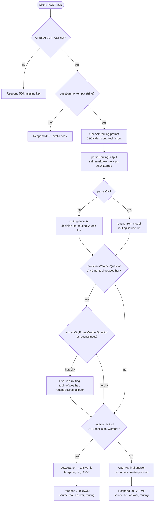
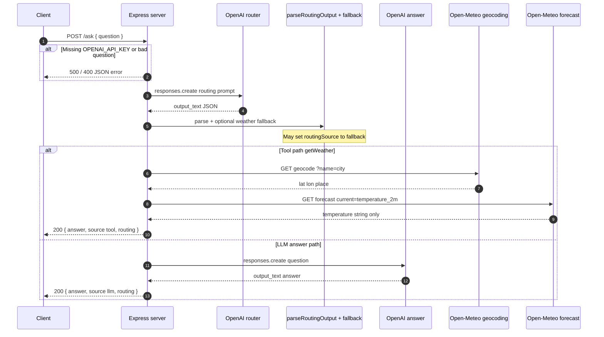

# Day 5 — Workflow diagrams (Mermaid)

Rendered by **Markdown Preview Enhanced** (and most Mermaid-capable previewers). Each diagram is in a `mermaid` fenced code block.

---

## Flow diagram (`POST /ask`)

High-level control flow matching `server.js`: load **session** history → router LLM (with history) → parse → optional weather fallback → tool or final LLM (with history) → **record** turn in memory.

---

## Sequence diagram

Shows **who** talks to **whom**: Express as orchestrator, two OpenAI calls on the LLM path, Open-Meteo only on the tool path.

---

## Legend

| Piece | Meaning |
| ----- | ------- |
| **Router** | First OpenAI call; must return JSON only (`decision`, `tool`, `input`). |
| **Fallback** | If text looks like weather but routing was wrong, derive city and force `getWeather`. |
| **getWeather** | No API key; returns only `${temp}${unit}` on success. |
| **Final LLM** | Second OpenAI call; answers the user question directly. |
